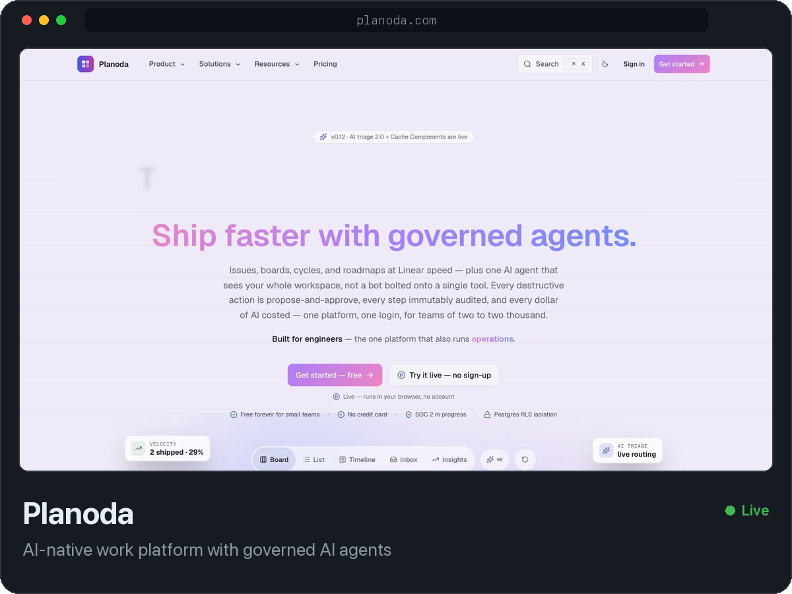
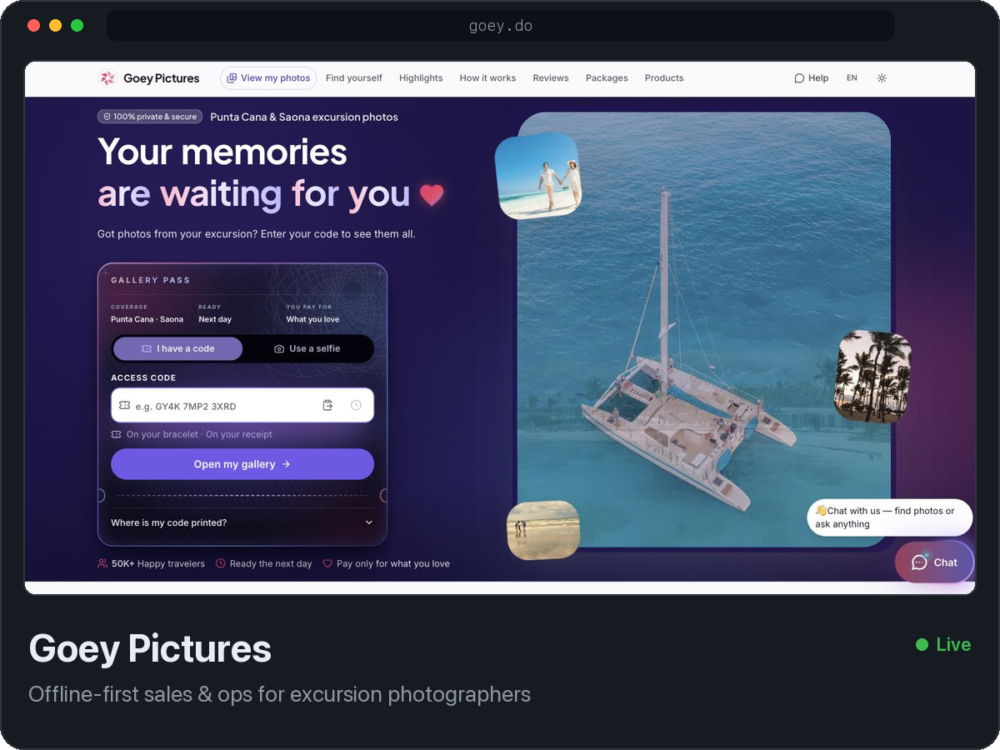
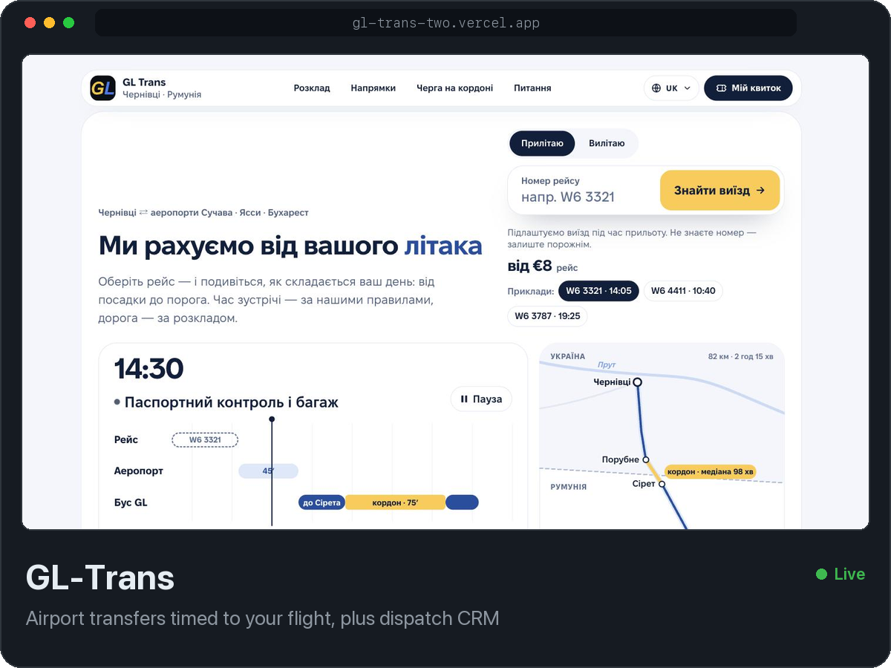
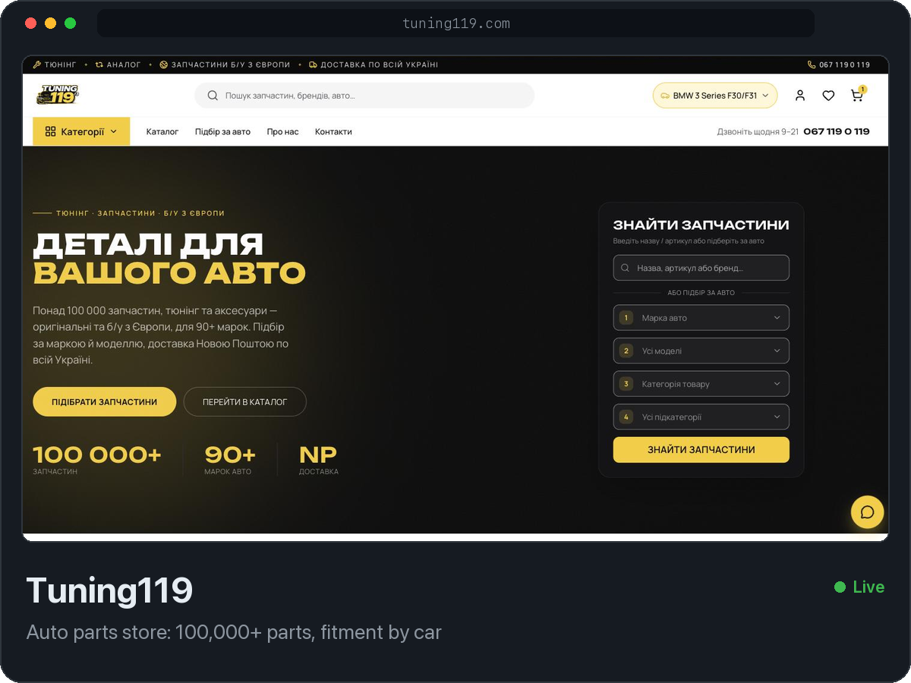

Full-stack developer. I work on production software end to end: data model, API, UI and deploys.
The code is private, so here is what I'm working on, live right now.

  
  

  
  

Also built: [119 Digital Studio](https://119-digital-studio.vercel.app) · D4S Detailing · Ukrresurs

Open to product work · [LinkedIn](https://www.linkedin.com/in/oleh-piontkovskyi/) · [Telegram](https://t.me/egokram)
