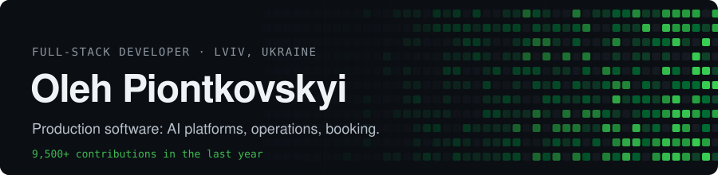

Hi, I'm Oleh 👋 I design, build and run web products end to end: database, API, UI, deploy.
Most of my work is private client code, so here is what it turned into.

### Selected work

**Products & systems**

| Project | What it is | Stack |
|---|---|---|
| [GL-Trans](https://gl-trans.vercel.app) | Fleet & trip management for a 40-bus carrier (Chernivtsi ⇄ Romanian airports): public booking site in 3 languages + ops dashboard | Next.js · Postgres |
| [ject.app](https://crm119.vercel.app) | Task & project manager for small teams: Team → Project → Task | Next.js · TypeScript · Postgres |
| Tuning119 | BMW body-kit storefront synced from a supplier API | Next.js 16 · Neon |

**Websites**

| Project | What it is | Stack |
|---|---|---|
| [D4S Detailing](https://github.com/krampusya/d4s) | Cinematic landing for a Kyiv detailing studio | Next.js 16 · GSAP · WebGL |
| [119 Digital Studio](https://119-digital-studio.vercel.app) | Studio site: web & marketing for automotive businesses | Next.js · Tailwind |
| Ukrresurs | Catalogue site for a waste-container manufacturer: 27 models, specs, gallery | Next.js 16 · static export |
| KUM Center | Business website | Next.js · TypeScript |

**Bots, tools & side projects**

| Project | What it is | Stack |
|---|---|---|
| Aleto Auto bot | Telegram bot for an auto-parts shop, orders go to Google Sheets | Python |
| Signeda scraper | Product catalogue scraper | Python |
| [Wishlist](https://wishlist-sage-pi.vercel.app) | Anonymous gift wishlist: guests reserve items, no sign-up | Vite · Node |

### Stack I actually use

### Now

🛠 Building [ject.app](https://crm119.vercel.app) · 📫 Open to freelance projects

[LinkedIn](https://www.linkedin.com/in/oleh-piontkovskyi/) · [119 Digital Studio](https://119-digital-studio.vercel.app)
